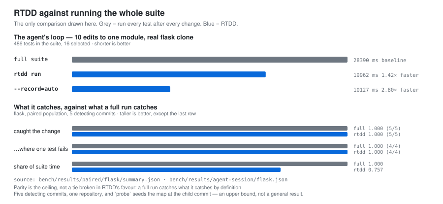

# rtdd

**rtdd is a test selector for coding agents.** Running every test after every edit is slow.
rtdd runs every test that executed the code you changed, directly or deep in a call chain.

## Install

```
npx github:VocanicZ/rtdd
```

One command, the same on Linux, macOS and Windows. It needs Node 18 or newer — `npx` is what
makes a single line work in bash, PowerShell and `cmd` alike, where no shell script can:
stock Windows has no POSIX `sh`, and Linux and macOS have no PowerShell.

It downloads the release binary for your platform, checks it against the published
`checksums.txt`, puts it on your PATH, and installs the agent skill below. `--version=<tag>`
pins a release, `--install-dir=<path>` chooses where the binary goes.

Or build from source, with Go 1.24 or newer, if you would rather not involve Node:

```
git clone https://github.com/VocanicZ/rtdd && cd rtdd
go build ./cmd/rtdd
```

The installer also installs a **machine-wide agent skill**, so your coding agent knows rtdd
exists in every repository — including ones where rtdd has not been set up yet, where the
skill tells it to run `rtdd init` first. It is written only for agents you already have: it
lands in `~/.claude/skills/rtdd/`, and as a marker-delimited block in `~/.codex/AGENTS.md`
and `~/.gemini/GEMINI.md`, and any of those directories that does not exist is skipped
rather than created. Pass `--no-skill`, or set `RTDD_NO_SKILL=1`, to install the binary
alone.

For any other agent — Cursor, whose user rules live in its settings rather than in a file,
or anything else — `rtdd skill prompt` prints a self-contained document to hand it.

```
rtdd skill install     # (re)install the machine-wide front-ends
rtdd skill prompt      # print a copy to paste into any other agent
rtdd skill uninstall   # remove them
```

`rtdd update` replaces the binary with the latest release, and only if it is newer, then
refreshes the machine-wide skill to match; `rtdd update --check` asks without installing.
`rtdd uninstall` removes what `rtdd init` wrote into a repository, leaving the recorded map
unless you add `--state`, and the machine-wide front-ends unless you add `--global`.

## Usage

```
cd your-python-repo
rtdd init      # front-ends, .gitattributes merge=union, config
rtdd seed      # one full instrumented run to build the map
rtdd which     # what covers your current changes
```

```
$ rtdd which
base:     HEAD
changed:  1 files
  modified  src/calc.py
  tier: T0  (2 tests selected, ranked)
  reason: tests whose recorded coverage intersects the changed set
    tests/test_calc.py::test_sub
    tests/test_calc.py::test_add

$ rtdd run
tier T0: 2 selected (tests whose recorded coverage intersects the changed set)
2 ran, 0 failed, 2 rows in the map

  UNCOVERED: src/calc.py:3-4  (2 changed lines, no executing test)
  import-time: src/calc.py:1  (executed during collection, not attributed)
  import-time: src/calc.py:5  (executed during collection, not attributed)
```

`rtdd init` writes a Claude Code skill at `.claude/skills/rtdd/SKILL.md`, a Cursor rule at
`.cursor/rules/rtdd.mdc`, and a marker-delimited block in `AGENTS.md` and `CLAUDE.md`. It
never edits outside its own markers. With no matching adapter it writes nothing and exits 2;
`--force` installs anyway.

It is a context provider, not a gate. `rtdd run` exits non-zero when a test fails, and for
no other reason.

## It runs more than the test you touched

Real code shares things. A small app might have `api.py` calling `auth.py`, both leaning on
`models.py` and `db.py`, and a `utils.py` that everything touches. You change `auth.py`.

A path heuristic matches `tests/test_auth.py` and stops — missing that `api.handle()` calls
straight into the function you just edited.

RTDD selects both, because the map records what each test *executed*, not what it is named.
Drawn as a graph, the rule is just *follow the edges into the file you changed* — and the
difference between the two approaches is that one has edges to follow and the other reads
none of them:

<picture>
  <source media="(prefers-color-scheme: dark)" srcset="docs/results/figures/how-it-picks-dark.svg">
  
</picture>

The map for that app, as `rtdd seed` recorded it:

```
test_api     →  api.py, auth.py, cache.py, db.py, models.py, utils.py
test_auth    →  auth.py, db.py, models.py, utils.py
test_report  →  db.py, models.py, report.py, utils.py
test_mailer  →  mailer.py, models.py, utils.py
test_models  →  models.py, utils.py
test_db      →  db.py, utils.py
test_cache   →  cache.py, utils.py
test_utils   →  utils.py
```

Change `src/auth.py` and the two tests whose rows contain it are selected — `test_auth`,
which any heuristic would find, and `test_api`, which none would: its name points at
`api.py`, and only the recorded coverage shows it reached `auth.py` from there.

It is transitive for free. `test_api` never imports `auth`; it calls `api.handle()`, which
calls `auth.login()`. The tracer does not care how deep that goes.

Change a *test* file instead and that test always runs, mapped or not.

The map and the selection are the real output of `rtdd seed` and `rtdd which` on that
app, committed under [`docs/results/worked-example/`](docs/results/worked-example/) and
read directly by the figure — including its captions, which are computed from the map
rather than written beside it.

One limit: this works from what the seed run recorded. A path no test has ever executed
is not in the map, so new code selects nothing until it has run once — which is what the
uncovered report tells you.

## Does it work?

RTDD is built for one loop: an agent edits, runs tests, edits again, dozens of times in a
single task. Without it the agent runs the whole suite every time. So there are two
questions — does RTDD save time, and does it miss anything the full suite would catch.

<picture>
  <source media="(prefers-color-scheme: dark)" srcset="docs/results/figures/rtdd-vs-full-dark.svg">
  
</picture>

### It saves time

Ten edits to one module in a real `flask` clone, tests run after each edit. Same machine,
same edits, three copies of the same repository:

| after every change | 10 edits | |
|---|---|---|
| run the whole suite | 28390 ms | |
| `rtdd run` | 19962 ms | **1.42× faster** |
| `rtdd run --record=auto` | 10127 ms | **2.80× faster** |

486 tests in the suite, 16 selected. Reproduce with
[`scripts/agent-session-bench.sh`](scripts/agent-session-bench.sh) against a seeded clone.

`--record=auto` skips re-recording coverage on cycles where the map has nothing new to
learn. You give up that cycle's uncovered report, and it tells you when it does.

RTDD's own cost is inside those numbers. `rtdd which` answers in **167 ms** on this clone,
down from **9774 ms** before its staleness scan was memoised — which was slower than just
running all 486 tests.

The edits above are additive no-ops, so nothing fails in any row. This measures cost only.

### It catches what the full suite catches

Testing that needs commits that actually break something: replay a commit's tests against
its parent's source and watch them fail. Most commits can't — they change only source, or
only tests, or only docs. Picking commits that changed both is what makes the question
answerable at all:

| flask commits replayed | that detect anything |
|---|---|
| 23 most recent | 3 |
| 6 that changed tests and source together | **5** |

Each one is a real commit whose real tests really failed against its parent's real source.
Nothing is injected or mutated. From
[`bench/results/paired/flask/summary.md`](bench/results/paired/flask/summary.md):

| | caught the change | where one test fails | share of suite time |
|---|---|---|---|
| run the whole suite | 1.000 (5/5) | 1.000 (4/4) | 1.000 |
| **rtdd** | **1.000 (5/5)** | **1.000 (4/4)** | **0.757** |

The middle column is the one to read. Those are the changes where exactly one test stands
between you and a missed regression, and RTDD ran all four of them. Matching the full suite
is the best result available here — a full run catches what it catches by definition.

**How far this goes.** Five commits, one repository. They were chosen for changing tests
and source together, and RTDD's map was seeded at the commit under test, so it knew about
code an agent would not have recorded yet. Enough to measure. Not enough to generalise —
more repositories are what would change that.

RTDD also reports which of your changed lines no test covers. On the published corpus that
report fired 12 times and was wrong zero times. Running the whole suite tells you nothing
about this.

## Documentation

- [Limitations](docs/LIMITATIONS.md) — where selection can be wrong, which languages get
  the weaker tier, and the coverage internals that constrain it.
- [Prior art](docs/PRIOR-ART.md) — pytest-testmon, TDAD, and the rest of the field RTDD
  builds on, with what each of them already does better.
- [Baseline comparison](docs/results/axis2-selection-baselines.md) — RTDD against
  pytest-testmon, a path heuristic and four other selectors, with wall-clock distributions
  per repository. RTDD does not win this one.
- [Design](docs/specs/2026-08-26-rtdd-design.md) — the full specification, including the
  measurements that killed three earlier design decisions.
- [Design audit](docs/audits/2026-08-26-design-audit.md) — what was measured, and what it
  killed.
- [Agent protocol](protocol/PROTOCOL.md) — the single source for every generated front-end
  under `dist/`. Edit it, run `rtdd-gen render`; CI fails if `dist/` is stale or if any
  front-end is wrong for its target.

## License

MIT. See [LICENSE](LICENSE).

## Star History

<a href="https://www.star-history.com/?repos=vocanicz%2Frtdd&type=date&legend=top-left">
 <picture>
   <source media="(prefers-color-scheme: dark)" srcset="https://api.star-history.com/chart?repos=vocanicz/rtdd&type=date&theme=dark&legend=top-left" />
   <source media="(prefers-color-scheme: light)" srcset="https://api.star-history.com/chart?repos=vocanicz/rtdd&type=date&legend=top-left" />
   
 </picture>
</a>
