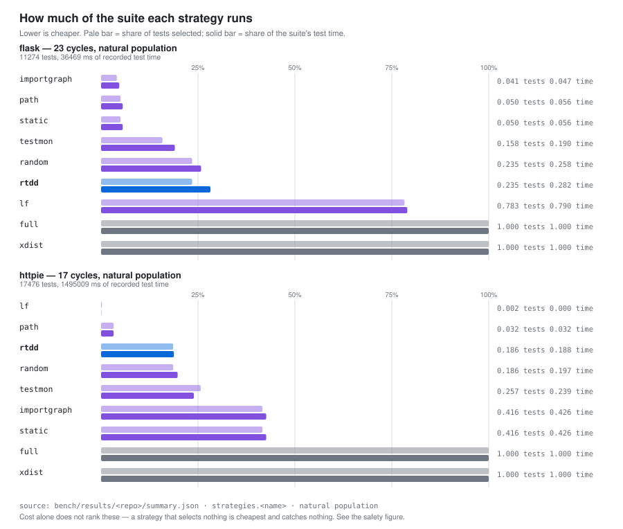
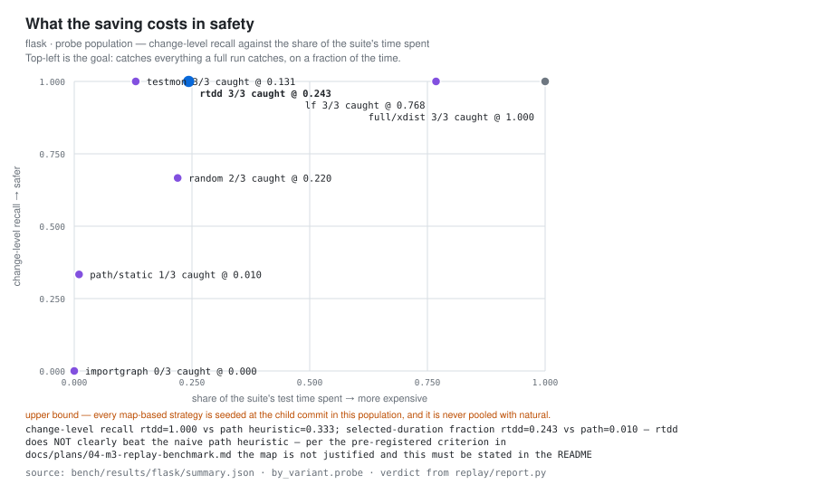
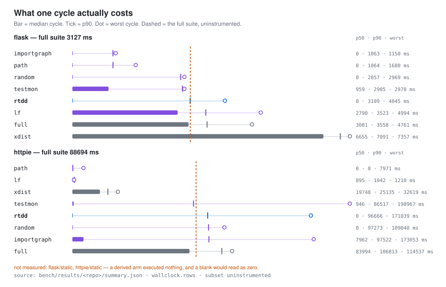

# rtdd

**rtdd tells an agent which tests cover the code it just changed, and which of the lines it
just changed nothing covers** — derived from real execution rather than a static call graph.

It is a context provider, not a gate. `rtdd run` exits non-zero when a test fails, and for
no other reason.

```
$ rtdd which
base:     HEAD
changed:  1 files
  modified  src/calc.py
  tier: T0  (2 tests selected, ranked)
  reason: tests whose recorded coverage intersects the changed set
    tests/test_calc.py::test_sub
    tests/test_calc.py::test_add

$ rtdd run
tier T0: 2 selected (tests whose recorded coverage intersects the changed set)
2 ran, 0 failed, 2 rows in the map

  UNCOVERED: src/calc.py:3-4  (2 changed lines, no executing test)
  import-time: src/calc.py:1  (executed during collection, not attributed)
  import-time: src/calc.py:5  (executed during collection, not attributed)
```

Execution-derived selection — the run above — is Python only today. Every other language
gets static selection instead, which is weaker evidence — and on the replay corpus that
static tier was pre-registered against the naive path heuristic and **did not beat it**, so
it does not carry its weight as a distinct tier on the evidence there is. It ships because a
repository RTDD cannot instrument is otherwise offered nothing, not because it is measured to
be better. The numbers are in
[The static tier against the same baseline](#the-static-tier-against-the-same-baseline--the-pre-registered-kill-condition);
the limits are in [What it does not do](#what-it-does-not-do).

## Install

There are two routes, and which one works depends on whether a release exists: **no release
is published yet**, so build from source today; the one-line installer below starts working
the moment a release is published, and is the shorter route once it does.

Build from source — Go 1.24 or newer:

```
git clone https://github.com/VocanicZ/rtdd && cd rtdd
go build ./cmd/rtdd      # writes ./rtdd — put it somewhere on your PATH
```

Or, once a release exists:

```
curl -fsSL https://raw.githubusercontent.com/VocanicZ/rtdd/main/install.sh | sh
```

Either way, the loop is the same:

```
cd your-python-repo
rtdd init      # front-ends, .gitattributes merge=union, config
rtdd seed      # one full instrumented run to build the map
rtdd which     # what covers your current changes
```

`rtdd init` installs a Claude Code skill at `.claude/skills/rtdd/SKILL.md`, a Cursor rule at
`.cursor/rules/rtdd.mdc`, and a short marker-delimited block in `AGENTS.md` (and `CLAUDE.md`
if you have one). It never rewrites a byte outside its own markers.

It first checks that an adapter matches the repository. If none does, it writes **nothing**
and exits 2: agent instructions promising a selection RTDD cannot make are worse than no
instructions at all. The way out is an adapter of your own in `.rtdd/adapters/<language>.yaml`
— or `rtdd init --force`, which installs anyway and states the caveat in the first paragraph
of the skill it writes.

## Prior art

RTDD did not invent test impact analysis. It is a late entry in a long line, and the
comparison against that line is the point of the project rather than a marketing frame.

- **[TDAD](https://arxiv.org/abs/2603.17973)** — *Test-Driven Agentic Development*, Alonso,
  Yovine and Braberman, March 2026 — is the closest work and the direct baseline. It builds a
  **static** source↔test dependency graph by parsing Python syntax trees, ships it to the
  agent as a skill file, and measured regressions on SWE-bench Verified falling from **6.08%
  to 1.82%**. Its reference implementation is at
  [pepealonso95/TDAD](https://github.com/pepealonso95/TDAD) and a TypeScript port is at
  [fmguerreiro/tdad-ts](https://github.com/fmguerreiro/tdad-ts). RTDD runs TDAD's own
  implementation as an arm of its benchmark rather than citing its number.

  **TDAD's second result is why this tool looks the way it does.** Adding TDD *procedural*
  instructions without targeted test context raised regressions to **9.94% — worse than no
  intervention at all**. Their conclusion is that surfacing contextual information beats
  prescribing procedural workflows, and RTDD is built on that conclusion: it reports, and it
  has no opinion about your patch.

- **[pytest-testmon](https://www.testmon.org/blog/determining-affected-tests/)** has done
  coverage-derived Python test selection since around 2016, with **method-level AST
  checksums** — finer-grained than RTDD's file-level rows. If you want test selection for a
  human's editor loop, use testmon. RTDD is not an improvement on it and does not claim to be.

- **[Wallaby.js](https://wallabyjs.com/docs/features/ai/)** already ships an MCP server
  exposing `wallaby_coveredLinesForTest` and `wallaby_allTestsForFileAndLine` to Claude Code
  and Cursor. Agent-facing coverage context is not a new idea; it is a shipping commercial
  product for JavaScript.

- **[Infinitest](https://github.com/infinitest/infinitest)** (2007) marketed classpath impact
  analysis for "tight TDD cycles" nearly two decades ago.

- **[Ekstazi](https://users.ece.utexas.edu/~gligoric/papers/GligoricETAL15Ekstazi.pdf)**
  (Gligoric, Eloussi and Marinov, 2015) is the reference result for file-level regression
  test selection, and the source of the most sobering number in this README: selecting a
  small fraction of tests still yielded only about **32% average end-to-end reduction**. That
  gap between "2% of tests selected" and "32% faster" is real, and RTDD measures itself
  against it rather than reporting selection ratio alone.

- **[SonarQube's new-code coverage gate](https://docs.sonarsource.com/sonarqube-server/latest/user-guide/clean-as-you-code/)**,
  Codecov's patch status, and `diff-cover` are prior art for "changed code that no test
  covers is a problem". RTDD's uncovered-change report is the same idea moved from CI into
  the inner loop, and reported rather than enforced.

- **[Bazel](https://bazel.build/query/guide)**, Google TAP, Microsoft's Azure DevOps Test
  Impact Analysis, `jest --findRelatedTests`, NCrunch, and
  **[Meta's predictive test selection](https://arxiv.org/abs/1810.05286)** are also in the
  lineage and are not claimed as novel here.

**What is new here, if anything, is one measurement.** Every tool above builds its map
either statically or from per-file coverage aggregates. TDAD published a static-graph number
on SWE-bench Verified with a reproducible harness. RTDD substitutes a **dynamic coverage**
map — which sees dynamic dispatch, dependency injection, plugin registries and monkeypatching
that a call graph reports as zero callers, and is blind in return to any path no test has
ever taken — and reruns the same benchmark. So the question *does execution-derived context
beat a call graph for agent regressions?* has an answer instead of an argument.

The answer is below, whichever way it fell.

## Results

RTDD exists for one loop: an autonomous agent edits, runs tests, edits again — dozens of
times per task. The baseline is what that agent does without it, and what the TDD skill
prescribes: **run the whole suite after every change.** RTDD is worth using only if it
costs the agent less time than that, while keeping the same safety and leaving test
quality alone.

Three axes, in the order that decides whether to use it. Each states what is measured,
what is not, and the committed record every figure is read from.

### Does it save the agent time? — yes, measured

Ten edits to one module in a real `flask` clone, no commits between them — the loop
above — against the same clone running its whole suite after every change. Same machine,
same edits, three copies of the same seeded repository:

| the agent's loop | 10 cycles | |
|---|---|---|
| runs the whole suite after every change | 28390 ms | baseline |
| `rtdd run` | 19962 ms | **1.42× faster** |
| `rtdd run --record=auto` | 10127 ms | **2.80× faster** |

Reproduce with [`scripts/agent-session-bench.sh`](scripts/agent-session-bench.sh) against
a seeded clone. `--record=auto` is the opt-in mode that runs the selection without
re-recording coverage on the cycles where the map has nothing to learn; it trades away
that cycle's uncovered report, and it says so on every cycle it takes.

**Nothing here was true a commit ago, and the reason is worth stating.** RTDD's own
selection step cost more than the suite it was avoiding: `rtdd which` took **9774 ms** on
this clone, against 2932 ms to run all 486 tests and 751 ms to run the 437 it selected.
The staleness scan (spec §4.1, T1) asks the age of the commit recorded on every selected
row, at three git subprocesses each, and a freshly seeded map records the same sha on
every row — so a 437-row selection asked one question 437 times and paid roughly thirteen
hundred process spawns for it. Memoised, the same command answers in **167 ms**.

That overhead never appeared in any published table because `bench/` measures selection
quality by running `pytest` itself: it never drives `rtdd run`, so RTDD's own cost was
outside every column it publishes. It took driving the shipped binary against a real
clone to see it, which is what `scripts/agent-session-bench.sh` now does on demand.

**What this table is not.** It is a cost measurement and only a cost measurement. The
edits are additive no-ops, so nothing fails in any arm and nothing here says the
selection would have caught what a full run catches. That is the next axis, and it is
still open.

### Is it as safe as running everything? — measurable at last, and it reaches parity

A full suite catches what it catches by definition, so RTDD can at best **match** it,
never beat it. Until now nothing could even ask: `natural` writes the child's whole diff
over the parent, which reproduces the green child commit and so detects nothing in any
repo, ever, and under the shipped `recent` commit rule `probe` found 3 detecting commits
in flask and none at all in httpie or sqlfluff. Every published recall figure reads
`n/a (0/0)` for that reason and no other.

`--commit-selection=paired` replays only commits that touch **both** a test file and a
non-test file — the one shape `probe` can detect anything from. It is corpus selection,
not fault injection: every commit is a real commit whose real tests really failed against
its parent's real source, which is why audit finding A8's rejection of a mutation harness
does not reach it.

| commit selection | replayed | detecting |
|---|---|---|
| `recent` (the published corpus) | 23 | 3 |
| `paired` | 6 | **5** |

On that population, from
[`bench/results/paired/flask/summary.md`](bench/results/paired/flask/summary.md):

| strategy | change recall | recall where exactly one test fails | share of suite time |
|---|---|---|---|
| **rtdd** | **1.000 (5/5)** | **1.000 (4/4)** | 0.757 |
| testmon | 1.000 (5/5) | 1.000 (4/4) | 0.603 |
| random | 0.800 (4/5) | 0.750 (3/4) | 0.690 |
| lf | 0.600 (3/5) | 0.750 (3/4) | 0.699 |
| path | 0.400 (2/5) | 0.250 (1/4) | 0.027 |
| importgraph | 0.000 (0/5) | 0.000 (0/4) | 0.000 |

The middle column is the one that matters: the `|F_full| == 1` stratum, where a single
failing test is all that stands between a selection and a missed regression. RTDD catches
every one. **On this population RTDD loses nothing a full run would have caught.**

**What that does not license.** Five detecting commits, one repository, on a population
biased by construction toward commits that changed code and tests together, and `probe`
remains an explicit upper bound — every map-based strategy is seeded at the child commit,
so RTDD and testmon both know about code an agent would not yet have recorded. It is
enough to make recall computable for the first time. It is not a general result, and
`testmon` reaches the same recall for less time.

The pre-registered criterion is still **not met**, and for the same reason it was not met
before: it asks for better recall than the naive `path` heuristic *at equal or better
selected duration*, and RTDD spends 0.757 of the suite's test time against `path`'s 0.027.
`summary.md`'s verdict line says so verbatim, win or lose.

**One safety-adjacent thing is separately measured, and it is clean.** The uncovered
report — which of the lines you just changed no test executes — fired on 12 cycles across
flask and httpie in the published corpus and was wrong **zero** times: 0/12 at change
level, 0/52 at line level. Running the whole suite does not tell you this; no selection
tool in the comparison below does either.

### Does it change test quality? — no, structurally

RTDD never writes, edits, ranks or deletes a test. Quality is whatever the suite already
had, however it was written. The only way RTDD can change an outcome is by not running
something, which is the safety axis above, not this one. There is nothing to measure here
and nothing is claimed.

### So: does it replace running everything?

**Closer than it has ever been, and not yet.** Time is measured and RTDD wins it —
1.42× at the shipped default, 2.80× with `--record=auto`. Quality is safe by
construction. Safety is measurable for the first time and RTDD reaches full-suite parity
on the population that can measure it, including the stratum where one failing test is
all that is at stake.

What is missing is not a win but a *sample*: five detecting commits on one repository, on
an upper-bound population, is where this evidence begins rather than ends. And on cost
against recall, `testmon` still matches RTDD for less time. What follows is every number
those answers are read from, win or lose.

## The measurements

### Axis 1 — agent regression rate on SWE-bench Verified

**Pending.** The pre-registered SWE-bench Verified run (git tag `prereg-m4`, 100-instance
sample, five arms — vanilla, TDD prose, TDAD static graph, RTDD dynamic coverage, RTDD +
prose — one harness, one model) has not been executed yet. `bench/results/swebench/` holds
only the run's pre-committed `config.json`; `tables.md` does not exist. No number is printed
here in its place. This section will be filled, unedited, from
[`bench/swebench/report.py`](bench/swebench/report.py)'s output once the run completes —
see [`bench/PREREGISTRATION.md`](bench/PREREGISTRATION.md) for the frozen sample, arms,
model, equivalence band, and kill criterion.

A regression is defined mechanically, in
[`bench/swebench/metrics.py`](bench/swebench/metrics.py): a test id in the SWE-bench
evaluation report's `tests_status.PASS_TO_PASS.failure` list — a test that passed before the
patch and fails after it. The denominator comes from the dataset rather than the report, and
instances whose patch is empty or fails to apply stay in both denominators, so no arm can
lower its regression rate by producing nothing. Resolution rate will be printed beside the
regression rate in every row for the same reason.

The RTDD arm's integration is a `rtdd_which` tool and a declarative description of what it
returns. Its prompt is byte-for-byte the vanilla arm's prompt plus one `<test-context>`
block — [asserted in a test](bench/swebench/tests/test_prompts.py), along with an
imperative-phrase lint on the block itself — because TDAD measured procedural prose as
actively harmful and an arm that smuggled it in would be uninterpretable.

### Axis 2 — selection quality on real commits

Replay of real commits per repo (`flask`, `httpie`, `sqlfluff`) against every baseline a
reviewer will ask for: pytest-testmon, a naive `tests/test_<module>.py` path heuristic,
`pytest --lf`, a static import graph, `pytest -n auto`, and random selection at equal
selection ratio. Never pooled across repos.

Condensed from `bench/results/{flask,httpie,sqlfluff}/summary.md` and
`bench/results/aggregate.md`. Full per-cycle detail and wall-clock rows are in
[`docs/results/axis2-corpus-replay.md`](docs/results/axis2-corpus-replay.md).

Everything in this section replays **committed** commits, one per fresh checkout with the
map seeded — so it is unaffected by the tier-rule fix, which only changes what happens
once a full run has already covered a config change within one session. The `drift.json`
curves that page also carries are the uncommitted-session measurement, they were taken
under the previous rule, and they are not summarised here or on the time axis above.

<picture>
  <source media="(prefers-color-scheme: dark)" srcset="docs/results/figures/axis2-savings-dark.svg">
  
</picture>

Cheapest is not best: `lf` runs 0.2% of httpie and `importgraph` 4% of flask, and nothing
in this figure says what either would have caught. That is the safety figure below.

> **Superseded in part by #184.** `sqlfluff` breaches the corpus's own admission criterion
> (~24 min uninstrumented suite against a 10-minute budget) and was removed at
> `corpus_version: 2`; it is kept here for the record and stays reproducible with
> `--corpus-version 1`.

**The pre-registered criterion**, from `docs/plans/04-m3-replay-benchmark.md`:

> if RTDD does not clearly beat the naive `tests/test_<module>.py` path heuristic on
> change-level recall at equal or better selected-duration fraction, the map is
> unjustified and the honest outcome is to say so in the README rather than ship it.

| repo | natural cycles | detecting commits (natural) | probe cycles | detecting commits (probe) |
|---|---|---|---|---|
| flask | 23 | 0 | 23 | 3 |
| httpie | 17 | 0 | 18 | 0 |
| sqlfluff | 2 | 0 | 2 | 0 |

**`natural` is not decided for any of the three repos.** All three real projects are
committed green; replaying a commit over its parent almost never reproduces a test the
parent already failed. Recall has no denominator in any of the three tables — the same
property that makes these repos worth measuring makes their recent history a poor source of
naturally red commits.

**`probe`** (source half of each commit reverted, tests kept, map seeded at the child
commit — an explicit upper bound, never pooled with `natural`) decides once and is silent
twice:

| repo | change recall (rtdd) | change recall (path heuristic) | selected-duration fraction (rtdd) | selected-duration fraction (path) |
|---|---|---|---|---|
| flask | 1.000 (3/3) | 0.333 (1/3) | 0.243 | 0.010 |
| httpie | n/a (0/0) | n/a (0/0) | — | — |
| sqlfluff | n/a (0/0) | n/a (0/0) | — | — |

<picture>
  <source media="(prefers-color-scheme: dark)" srcset="docs/results/figures/axis2-safety-dark.svg">
  
</picture>

The trade RTDD exists to make is the vertical axis bought with the horizontal one: keep what
a full run catches, on a fraction of a full run's time. Nine points, one repository and an
upper-bound population decide everything visible here — the picture is the shape of the
question, not an answer to it.

On flask's probe population RTDD catches every detecting change but spends roughly 24× the
path heuristic's selected-duration fraction doing it. The criterion asks for better recall
**at equal or better duration** — **not met**. `testmon` matches RTDD's recall at under half
the duration on this sample.

**Verdict: the pre-registered criterion is not met on `probe`, and remains undecided on
`natural`.** No stratified `|F_full| == 1` table is shown: zero detecting commits occurred at
any `|F_full|` in `natural`, in any repo, at the depth reached.

#### The static tier against the same baseline — the pre-registered kill condition

The map is not the only thing that was pre-registered against `path`. So was the **static
tier** — the tier every non-Python repository gets — in
[`docs/specs/2026-09-05-multi-language.md`](docs/specs/2026-09-05-multi-language.md) §7:

> If the static tier does not beat the `path` baseline it is not worth shipping as a
> distinct tier, and the README says so.

"Beat", on the metrics that section publishes: higher change-level recall at a comparable or
better selected-duration fraction. A tie is not a beat, and recall bought by selecting more
of the suite is not a beat either — an arm that buys recall with time is on its way to being
`full`.

The `static` arm executes nothing: it is a function of each replayed commit's own committed
records — the changed set, the tests that commit collected, and its `importgraph` selection —
so it was derived offline and **no benchmark was re-run** to score it. Read from
[`bench/results/flask/summary.json`](bench/results/flask/summary.json) and
[`bench/results/httpie/summary.json`](bench/results/httpie/summary.json):

| repo | population | change recall (static) | change recall (path heuristic) | selected duration (static) | selected duration (path) |
|---|---|---|---|---|---|
| flask | natural | n/a (0/0) | n/a (0/0) | 0.056 | 0.056 |
| flask | probe (upper bound) | 0.333 (1/3) | 0.333 (1/3) | 0.010 | 0.010 |
| httpie | natural | n/a (0/0) | n/a (0/0) | 0.426 | 0.032 |
| httpie | probe (upper bound) | n/a (0/0) | n/a (0/0) | 0.286 | 0.000 |

**The kill condition fired.** On the one population that has any ground truth at all —
flask's `probe`, three detecting commits — `static` scores 0.333 change-level recall at a
0.010 selected-duration fraction and the path heuristic scores 0.333 at 0.010: the same
commits caught, at the same cost. A tie is not a beat, and the criterion asks for a beat.
Nowhere else is the comparison computable — neither repo's `natural` population and neither
httpie population contains a single detecting commit, so recall has no denominator — and
where only cost can be read, httpie's `natural` `static` arm spends 0.426 of the suite's
duration against the path heuristic's 0.032, roughly 13× more of the suite for recall nobody
could measure.

**So the static tier does not carry its weight as a distinct tier on this evidence.** It
selects what a naive `tests/test_<module>.py` heuristic already selects, and where it selects
more it has not been shown to catch more. It ships anyway because a repository RTDD cannot
instrument is otherwise offered nothing at all — not because it is measured to be better —
and two repositories would not be a general result in either direction.

#### Wall-clock: the distribution, never a bare mean

Wall-clock is from disclosed hardware in each repo's own `config.json`, never from a CI
runner; `sqlfluff`'s wall-clock rows are withheld (`--no-wallclock`, contended host) rather
than published inflated.

What one cycle costs to *execute* the selection, uninstrumented. The population is bimodal —
a cycle whose strategy selected nothing costs almost nothing, a cycle that selected the hub
costs nearly a full run — so the mean falls between the two modes and describes neither half.
`p50`, `p90` and `worst` are nearest-rank over the committed per-cycle samples in
`bench/results/<repo>/commits.jsonl`, so every figure below is a cycle that really ran.

<picture>
  <source media="(prefers-color-scheme: dark)" srcset="docs/results/figures/axis2-wallclock-dark.svg">
  
</picture>

The distance between the bar and the dot is the finding. RTDD's median cycle is free on both
repos; its worst crosses the dashed full-suite line on httpie and comes close on flask.

**flask** — full suite, uninstrumented: mean 3127 ms · p50 3001 ms · p90 4294 ms · worst 4486 ms.

| strategy | n | mean | p50 | p90 | worst |
|---|---|---|---|---|---|
| rtdd | 24 | 1284 ms | 0 ms | 3109 ms | 4045 ms |
| testmon | 24 | 1103 ms | 959 ms | 2905 ms | 2970 ms |
| path | 24 | 255 ms | 0 ms | 1064 ms | 1680 ms |
| lf | 24 | 2496 ms | 2790 ms | 3523 ms | 4994 ms |
| importgraph | 24 | 171 ms | 0 ms | 1063 ms | 1150 ms |
| xdist | 24 | 6593 ms | 6655 ms | 7091 ms | 7357 ms |
| random | 24 | 1201 ms | 0 ms | 2857 ms | 2969 ms |
| full | 24 | 3133 ms | 3081 ms | 3558 ms | 4761 ms |

**httpie** — full suite, uninstrumented: mean 88694 ms · p50 84531 ms · p90 102994 ms · worst 108210 ms.

| strategy | n | mean | p50 | p90 | worst |
|---|---|---|---|---|---|
| rtdd | 18 | 25423 ms | 0 ms | 96666 ms | 171039 ms |
| testmon | 18 | 26377 ms | 946 ms | 86517 ms | 198967 ms |
| path | 18 | 443 ms | 0 ms | 0 ms | 7971 ms |
| lf | 18 | 932 ms | 895 ms | 1042 ms | 1210 ms |
| importgraph | 18 | 49603 ms | 7962 ms | 97522 ms | 173053 ms |
| xdist | 18 | 20964 ms | 19748 ms | 25135 ms | 32619 ms |
| random | 18 | 20880 ms | 0 ms | 97273 ms | 109040 ms |
| full | 18 | 89957 ms | 83994 ms | 106813 ms | 114537 ms |

Read the `rtdd` rows against their own means. On flask the mean of 1284 ms is 41% of the p90
and 32% of the worst, and the median cycle costs nothing at all; the worst cycle costs more
than the whole suite's mean run. On httpie the mean of 25.4 s hides a worst cycle of 171 s —
close to twice the full suite. A reader given only the mean would take RTDD for a strategy
that steadily costs a fraction of a run. It is a strategy that usually costs nothing and
occasionally costs more than running everything, and the two halves are the finding.

Duration-weighted aggregate (ordering only — recall is never pooled), from
`bench/results/aggregate.md`:

| strategy | duration-weighted selected fraction | repos |
|---|---|---|
| full | 1.000 | 2 |
| xdist | 1.000 | 2 |
| importgraph | 0.417 | 2 |
| testmon | 0.238 | 2 |
| random | 0.199 | 2 |
| rtdd | 0.190 | 2 |
| path | 0.033 | 2 |
| lf | 0.019 | 2 |

## What it does not do

- **It does not enforce anything.** No gate, no policy exit code, no expected-phase flag.
- **It does not replace CI.** Running `rtdd` is a convenience for the inner loop, not a
  substitute for a full CI run.
- **It is not sound program analysis.** This is risk-managed test selection and says so.
- **It does not reduce token cost.** There are no model calls in the hot path.
- **Two tiers, and only one of them is measured coverage.** *Execution-derived* selection —
  the tier RTDD exists for — is Python only. Per-test attribution does not exist in the
  JavaScript or Go ecosystems: Istanbul and v8 coverage carry aggregate counters with no
  test dimension ([vitest#6735](https://github.com/vitest-dev/vitest/issues/6735) has
  requested it since October 2024), and Go's `-coverprofile` has no test dimension either
  while per-test isolation costs a prebuilt binary driven once per test. Every other
  language gets *static* selection instead: declared file correspondence and imports, with
  nothing instrumented. It never watched a test run, so it can miss a test an
  execution-derived selection would have caught, and passing it is weaker evidence. Every
  surface says which tier you are reading, because the two are not interchangeable. **The
  static tier was pre-registered against the naive path heuristic and did not beat it** —
  level with it where recall could be scored at all, and more expensive where it could not
  (see [the kill condition](#the-static-tier-against-the-same-baseline--the-pre-registered-kill-condition))
  — so it does not carry its weight as a distinct tier on the evidence there is.
- **Coverage is blind in its own way.** It only knows paths some test actually took, and it
  attributes nothing to code executed at import time — which is why the uncovered report has
  a separate import-time class instead of calling dataclasses and enums untested.
- **`COVERAGE_CORE=ctrace` is forced**, so instrumented runs pay roughly 2× tracing overhead.
  With coverage.py's `sysmon` core — the default on Python 3.14+ — dynamic contexts are
  silently dropped with a warning and a zero exit, producing a mostly-empty map; RTDD treats
  that warning as fatal.

## Documentation

- [Design](docs/specs/2026-08-26-rtdd-design.md) — the full specification, including the
  measurements that killed three earlier design decisions.
- [Design audit](docs/audits/2026-08-26-design-audit.md) — what was measured, and what it
  killed.
- [Agent protocol](protocol/PROTOCOL.md) — the single source for every generated front-end
  under `dist/`. Edit it, run `rtdd-gen render`; CI fails if `dist/` is stale or if any
  front-end is wrong for its target.

## License

MIT. See [LICENSE](LICENSE).
